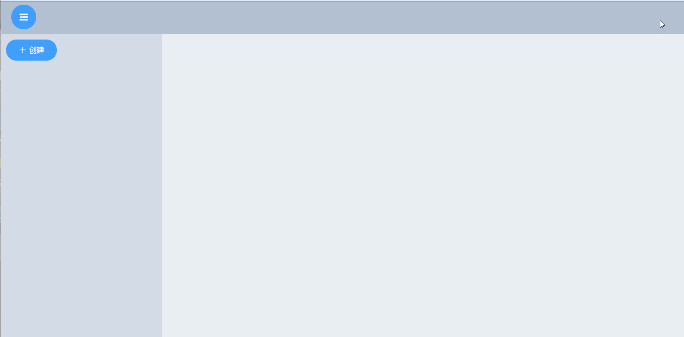

# ScheduleManage

## 日程管理



技术栈主要使用

前端：vue-cli3.9.2+vue+elementUI+vuex+vue-router+axios

后台：node+express+mongoose

## 安装 npm 包

```
npm install 后台依赖
npm run client-install 前台依赖
```

## 运行项目

```
npm run dev
```
